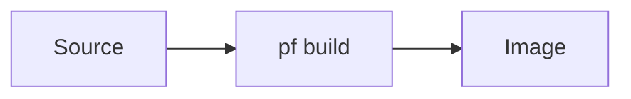

# Doc style guide

Conventions for writing handbook pages so the guide reads as one coherent
document. When in doubt, match an existing real page (this one, or
[Contributing](index.md)).

## Voice & scope

- **Audience:** developers and operators getting involved with PocketForge —
  not end users. Assume comfort with a shell, `git`, and SSH; explain
  PocketForge-specific concepts.
- **Voice:** direct and imperative ("Run…", "Acquire the place…"). Prefer short
  sentences and second person.
- **Scope per page:** one page, one job. If a page grows two distinct jobs,
  split it and add both to the nav.

## Page structure

- Start every page with a single `# H1` that matches its nav label.
- Use `##`/`###` for structure; the right-hand table of contents is generated
  from them, and headings get permalinks automatically.
- Put the "what/why" up top; put reference tables and edge cases lower.

## Physical assembly guides

Physical assembly is a distinct documentation shape. A reader may be
technically capable while having no vocabulary for the material or fastener in
front of them. Do not make them learn the designer's naming system before they
can complete the first action.

Use the [test-node chassis assembly](../hardware/test-node-chassis/assemble/index.md)
as the local reference implementation. The step discipline is informed by
[Prusa's Y-axis assembly guide](https://help.prusa3d.com/guide/2-y-axis-assembly_25488):
show a bounded working set, make the picture and text point to the same thing,
and verify the result before advancing.

### Chapter architecture

Split a substantial physical build into four layers:

1. **Overview:** destination, scope, orientation, difficulty, safety, and the
   shortest vocabulary needed to begin.
2. **Preparation:** global parts/tools, fabrication, printing, cutting, and
   labeling. These are separate jobs and may remain separate pages.
3. **Assembly chapter:** one bench-sized physical decision per page, in strict
   order.
4. **Verification:** a final end-to-end checklist that tests geometry,
   movement, orientation, and safety independently of the build prose.

Do not put an entire multi-hour assembly on one scrolling page. A long page is
useful as an expert reference but poor as a bench interface: it hides the
current parts, encourages skipped preloads, and makes mobile navigation
fragile.

### Contract for every assembly step

Every step page must include:

- `Step N of M` and explicit previous/next navigation;
- a large view of the action or destination, shown before prose on narrow
  screens;
- **Get these parts**, with exact quantities and the bag, print batch, or cut
  label that identifies each item; use a visible category word such as
  **Aluminum**, **Printed**, **M3**, **Tool**, or **Assembled**, never an
  unlabeled color swatch;
- one bounded action sequence—split the page again if it contains two
  independently reversible jobs;
- plain-language names first, with the source/CAD term in parentheses only
  when it helps someone find the part;
- a compact **Read the picture** key that pairs every instructional highlight,
  arrow, line, label, or ghosted part with the same color and an explicit
  local name such as **Blue arrow** or **Orange part**;
- a prominent **Before you continue** state that a first-time builder can
  compare with the work in front of them.

Repeat a critical warning immediately before the action it protects. Do not
rely on a warning that appeared several pages earlier.

### Images and annotations

Use both generated drawings and bench photography, according to what each does
best:

- **CAD or vector views:** hidden nuts, exploded order, insertion direction,
  dimensions, optical paths, and correct/incorrect geometry.
- **Real photographs:** recognizing a supplied part, surface/print quality,
  hand and tool placement, cable flex, and what a correctly seated physical
  interface looks like.

Every meaningful step gets at least one visual. Keep the viewpoint and
operator/device orientation consistent across a chapter. Highlight the new
part, fade completed context, and put arrows or circles directly on the feature
named by the adjacent instruction.

Never encode meaning by color alone. Repeat each instructional color in the
adjacent **Read the picture** key and pair it with a shape or explicit word.
Use silver or light gray—not black—for aluminum, and keep CAD views on a
light, bounded drawing surface so the rails remain legible in both light and
dark themes. Alt text names the highlighted part, action, and direction;
captions explain the correctness cue rather than repeating the heading.

### Maintenance

Generated assembly images must identify and pin their source revision. A strict
build should fail when a required step visual disappears, navigation skips a
step, or a generated asset is stale. When the physical design changes, update
the assembly sequence, per-step parts, verification gate, and source gitlink in
the same change. The handbook tracks the CAD gitlink with Dependabot so source
changes automatically open a regeneration PR instead of silently leaving the
published models stale.

## Admonitions

Use [admonitions](https://squidfunk.github.io/mkdocs-material/reference/admonitions/)
for callouts. Supported types include `note`, `tip`, `warning`, `danger`,
`info`, `example`.

```markdown
!!! tip "Optional title"
    Body text, indented four spaces.

!!! danger "Destructive"
    Use `danger` for anything that can brick a device or destroy data.
```

Use `???` instead of `!!!` for a collapsible block.

## Checklists (the bring-up spine)

Procedures use GFM task lists — they render as real checkboxes:

```markdown
- [ ] Do the first thing
- [x] Something already done
```

The [⭐ bring-up checklist](../bring-up-checklist.md) is built entirely from
these; keep procedure steps as ordered checkbox items so they slot into it.

## Content tabs (per-board / per-host variants)

When a step differs by board or host, use content tabs instead of duplicating
the page:

```markdown
=== "Base (A133)"
    Instructions for the base unit.

=== "Pro S (A523)"
    Instructions for the Pro S.
```

## Code & commands

- Fence commands with a language for highlighting and a copy button:
  ` ```bash `.
- Show the command *and* what success looks like; don't paste whole logs.

## Diagrams

Use [Mermaid](https://mermaid.js.org/) fenced blocks for architecture and flow
diagrams — they render natively:

````markdown

````

## Links

- Link **relative to the current file** (`../lab/power.md`), always ending in
  `.md` — `mkdocs build --strict` fails the build on a broken link.
- Link out to source repos with full GitHub URLs; don't duplicate content that
  lives authoritatively elsewhere — link to it.

## The 🚧 stub convention

An unfinished page is a **visibly-marked stub**, never a blank or half-written
page. A stub is exactly:

1. Its `# H1` title.
2. A `warning` admonition titled **"🚧 Stub — content authored separately"**.
3. A one-line **"What this page will cover:"** sentence.

```markdown
# Page title

!!! warning "🚧 Stub — content authored separately"
    This page is a scaffold placeholder created in infra-261 Phase A. See
    [how to add a page](../contributing/add-a-page.md).

**What this page will cover:** one sentence describing the page's eventual scope.
```

This keeps the nav complete and every gap obvious. To fill a stub, replace
everything below the `# H1` with real content — see
[how to add a page](add-a-page.md).
