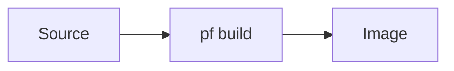

# Doc style guide

Conventions for writing handbook pages so the guide reads as one coherent
document. When in doubt, match an existing real page (this one, or
[Contributing](index.md)).

## Voice & scope

- **Audience:** developers and operators getting involved with PocketForge —
  not end users. Assume comfort with a shell, `git`, and SSH; explain
  PocketForge-specific concepts.
- **Voice:** direct and imperative ("Run…", "Acquire the place…"). Prefer short
  sentences and second person.
- **Scope per page:** one page, one job. If a page grows two distinct jobs,
  split it and add both to the nav.

## Page structure

- Start every page with a single `# H1` that matches its nav label.
- Use `##`/`###` for structure; the right-hand table of contents is generated
  from them, and headings get permalinks automatically.
- Put the "what/why" up top; put reference tables and edge cases lower.

## Admonitions

Use [admonitions](https://squidfunk.github.io/mkdocs-material/reference/admonitions/)
for callouts. Supported types include `note`, `tip`, `warning`, `danger`,
`info`, `example`.

```markdown
!!! tip "Optional title"
    Body text, indented four spaces.

!!! danger "Destructive"
    Use `danger` for anything that can brick a device or destroy data.
```

Use `???` instead of `!!!` for a collapsible block.

## Checklists (the bring-up spine)

Procedures use GFM task lists — they render as real checkboxes:

```markdown
- [ ] Do the first thing
- [x] Something already done
```

The [⭐ bring-up checklist](../bring-up-checklist.md) is built entirely from
these; keep procedure steps as ordered checkbox items so they slot into it.

## Content tabs (per-board / per-host variants)

When a step differs by board or host, use content tabs instead of duplicating
the page:

```markdown
=== "Base (A133)"
    Instructions for the base unit.

=== "Pro S (A523)"
    Instructions for the Pro S.
```

## Code & commands

- Fence commands with a language for highlighting and a copy button:
  ` ```bash `.
- Show the command *and* what success looks like; don't paste whole logs.

## Diagrams

Use [Mermaid](https://mermaid.js.org/) fenced blocks for architecture and flow
diagrams — they render natively:

````markdown

````

## Links

- Link **relative to the current file** (`../lab/power.md`), always ending in
  `.md` — `mkdocs build --strict` fails the build on a broken link.
- Link out to source repos with full GitHub URLs; don't duplicate content that
  lives authoritatively elsewhere — link to it.

## The 🚧 stub convention

An unfinished page is a **visibly-marked stub**, never a blank or half-written
page. A stub is exactly:

1. Its `# H1` title.
2. A `warning` admonition titled **"🚧 Stub — content authored separately"**.
3. A one-line **"What this page will cover:"** sentence.

```markdown
# Page title

!!! warning "🚧 Stub — content authored separately"
    This page is a scaffold placeholder created in infra-261 Phase A. See
    [how to add a page](../contributing/add-a-page.md).

**What this page will cover:** one sentence describing the page's eventual scope.
```

This keeps the nav complete and every gap obvious. To fill a stub, replace
everything below the `# H1` with real content — see
[how to add a page](add-a-page.md).
