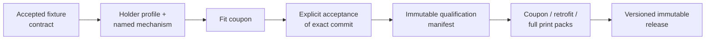

# Design and qualify a DUT holder

Turn one accepted device fixture interface into a reproducible holder and an
exact print pack. Start this chapter after the handheld model has passed its
in-hand gate. Finish it before printing the device-specific parts for a
production test node.

!!! warning "The visual mesh is not manufacturing truth"
    The semantic model describes appearance, controls, and useful physical
    context. Holder tolerances come from the versioned fixture contract and
    in-hand measurements. Never copy a shell dimension or contact position
    from a render mesh merely because the model looks accurate.

## Keep source and generated output separate

| Layer | Where it lives | Commit it? | Purpose |
| --- | --- | ---: | --- |
| Semantic model and skin | `platform/device-models/<device-slug>/` | Yes | Appearance, controls, simulator views, and semantic identity |
| Fixture contract | Beside the semantic model | Yes | Manufacturing envelope, datums, contact regions, keep-outs, tolerances, and evidence |
| Accepted fixture lock | `test-node-hw` holder profiles | Yes | Exact platform revision, raw contract hashes, and resolved interface used by accepted history |
| Candidate lock and receipt | Holder-design branch | Yes | Changed upstream input in `awaiting_holder_design`; not production input |
| Holder profile | `mechanical/dut-cradle-v1/profiles/` | Yes | Selected contacts, mechanism parameters, artifacts, device variants, and qualification link |
| Reusable mechanism source | `mechanical/dut-cradle-v1/lib/` and templates | Yes | Parameterized deterministic OpenSCAD implementation |
| Change and qualification records | `mechanical/dut-cradle-v1/qualification/` | Yes | Append-only intent, geometry identity, print process, and physical acceptance |
| Routine STL, preview, and geometry diff | Local temporary paths or CI artifacts | **No** | Review and printing output regenerated from committed source |
| Local or PR print pack | Ignored build path or CI artifact | **No** | Ephemeral coupon, retrofit, or full bundle |
| Accepted production pack | Versioned GitHub release | Release assets | Immutable archive owned by one qualification manifest |

An accepted fixture lock is a committed dependency lock, not a second editable
copy of the platform contract. Accepted locks, qualification manifests, change
history, tags, and release assets are never rewritten.

## Read the state before changing geometry

These names belong to different records. Do not collapse them into one generic
"approved" flag.

| State or event | Stored on | What it allows | Stop condition |
| --- | --- | --- | --- |
| Visual-only change / no fixture-interface drift | Platform comparison | No holder edit. Regenerate the existing qualified source only when output is needed. | Stop if the resolved fixture-interface hash changes. |
| `awaiting_holder_design` | Candidate intake receipt | Design review only. The prior accepted profile and release remain untouched. | The candidate cannot drive a pack or claim acceptance. |
| `unqualified` | Holder profile | Explicit fit-coupon or review rendering; output is non-production. | Production `retrofit` and `full` packs remain blocked. |
| `awaiting_physical_acceptance` | Geometry-change record | Candidate meshes, `geometry-diff.json`, and physical coupon/carrier trials. | A passing render or photo is not acceptance. |
| `physically_accepted` | Completed geometry-change record | A later PR may bind the explicit owner decision to an unchanged candidate. | Production remains blocked until the new manifest and qualified profile agree. |
| `physically_qualified` | Holder profile plus immutable manifest | Production-eligible `coupon`, `retrofit`, and `full` packs. | Any later fit-bearing input change invalidates the qualification. |
| Released | Versioned qualification tag | Download and verify immutable production assets. | Never replace the tag or an asset; a changed accepted fit gets a new version. |

An unqualified override can mark a prototype pack permanently
non-production. It does not bypass any gate and is not part of the
administrator production path.

## Choose one design lane

Use the repository-owned
[`design-dut-holder` skill](https://github.com/pocketforge-os/test-node-hw/tree/main/.agents/skills/design-dut-holder)
when an agent is helping with the holder. A handbook checkout pins the exact
skill and CAD revision under `cad/test-node-hw`.

### Existing mechanism

Choose [reuse an existing mechanism](existing-mechanism.md) when a named
family such as `perimeter_j_hook_v1` can place every contact inside its safe
fixture-contract interval without blocking controls, ports, vents, cables,
service access, or the camera.

This is primarily strict data authoring and physical validation. Once the
profile is committed, regeneration does not require an LLM.

### New mechanism

Choose [create a reusable mechanism](new-mechanism.md) when the device needs a
different retention class: for example, a curved cup, stepped support, sliding
rail, or compliant clip. Agent-assisted CAD is reasonable during this design
phase, but the accepted result must become named parameterized OpenSCAD plus
tests and profile data.

`custom_openscad` is an unqualified prototyping escape hatch. It is never the
qualified endpoint.

Both lanes finish at the same
[physical qualification and release workflow](qualify-and-release.md).

## Keep electrical integration out of the holder profile

Use the same canonical device slug for the later device integration profile,
but keep these fields separate from mechanical retention:

- DUT PCB and pigtail revisions;
- rail-mounted relay, hub, adapter, or protection modules;
- USB, UART, FEL, battery, VBUS, and other wiring topology;
- named power modes and serial endpoints;
- labgrid resources and per-node deployment bindings; and
- append-only physical harness qualification evidence.

Do not guess those facts while designing the holder. The holder handoff names
mounting and cable keep-outs; the device integration profile owns electrical
and deployment truth.

## Before choosing a lane

- [ ] The canonical device slug and hardware revision are unambiguous.
- [ ] The exact platform fixture contract is committed and source-verifiable.
- [ ] Fit-critical values are measured in hand; unresolved values remain
      explicitly unresolved.
- [ ] Existing accepted locks, manifests, releases, and change records are
      identified before editing.
- [ ] A claimed work order and dedicated `test-node-hw` worktree exist.
- [ ] The physical reviewer and exact acceptance criteria are named.
