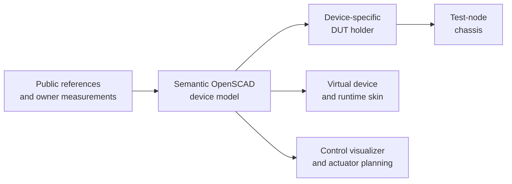

# Model a handheld

Create the device-accurate semantic 3D model **before** fabricating its
device-specific DUT holder. This is the first mechanical artifact in a new
handheld onboarding: it establishes the physical envelope, visible controls,
ports, screen, and stable semantic input IDs that every later consumer shares.

The model is source-owned in
[`pocketforge-os/platform/device-models`](https://github.com/pocketforge-os/platform/tree/main/device-models).
Its OpenSCAD source uses physical millimetres, but each dimension also records
whether it was measured, published, inherited, or estimated from a photograph.

!!! warning "Visual accuracy is not manufacturing tolerance"
    A picture-perfect model can still contain photo-derived dimensions. Use it
    for identity, layout, simulation, and early clearance work. Do not release
    a fitted DUT holder until the dimensions that control physical fit have
    been checked on the real device.

## Finish two acceptance gates

| Gate | When | What it unlocks |
| --- | --- | --- |
| **Remote-evidence first pass** | Before the handheld arrives | Virtual-device work, semantic input planning, visual review, and early fixture-envelope studies |
| **In-hand accepted model** | After caliper measurements and perpendicular photographs | Device-specific holder generation, final camera/actuator clearances, runtime-skin handoff, and model merge |

Complete the remote-evidence gate before entering the chassis fabrication
workflow. Complete the in-hand gate before generating or printing anything
that must fit the DUT.

## Produce one source package

The source-model task produces:

- one semantic OpenSCAD package under `device-models/<slug>/`;
- a README with identity, coordinate system, dimensions, provenance,
  confidence, reproduction commands, and known limits;
- deterministic front, rear, top, bottom, left, and right evidence views;
- independently selectable/highlightable physical controls;
- a renderer and a privacy-safe comparison tool;
- the owner’s explicit visual approval of the exact reviewed commit.

Runtime skin assets and the device-specific DUT holder are downstream
deliverables. Keep them in separate tasks so a correct source model can be
reviewed and merged without silently expanding its acceptance gate.

## Prepare the workstation

You need:

- a claimed PocketForge modeling work order and a dedicated `platform`
  worktree;
- OpenSCAD 2021.01 or newer and Python 3.11 or newer;
- the exact manufacturer, product name, model number, and intended PocketForge
  device ID;
- access to the device descriptor or a proposed semantic input list;
- a directory **outside git** for owner photographs and comparison output.

Codex automatically discovers the repository’s
[`model-handheld-device` skill](https://github.com/pocketforge-os/platform/tree/main/.agents/skills/model-handheld-device).
Another agent can follow the same `SKILL.md` directly.

## Follow this path

1. [Gather model evidence](gather-evidence.md) and choose a baseline.
2. [Build the semantic model](build-model.md) with the repository skill.
3. [Refine and accept the model](refine-and-accept.md) when the device is in
   hand.
4. Continue to [Build the test-node chassis](../test-node-chassis/index.md)
   only after the applicable model gate passes.

## Before you continue

- [ ] The exact retail model and hardware revision are unambiguous.
- [ ] The source-model task, runtime-skin task, and DUT-holder task have
      separate acceptance boundaries.
- [ ] Private photos have a storage location outside every repository.
- [ ] The person who can visually approve the model is available for the
      fixed-view review loop.
