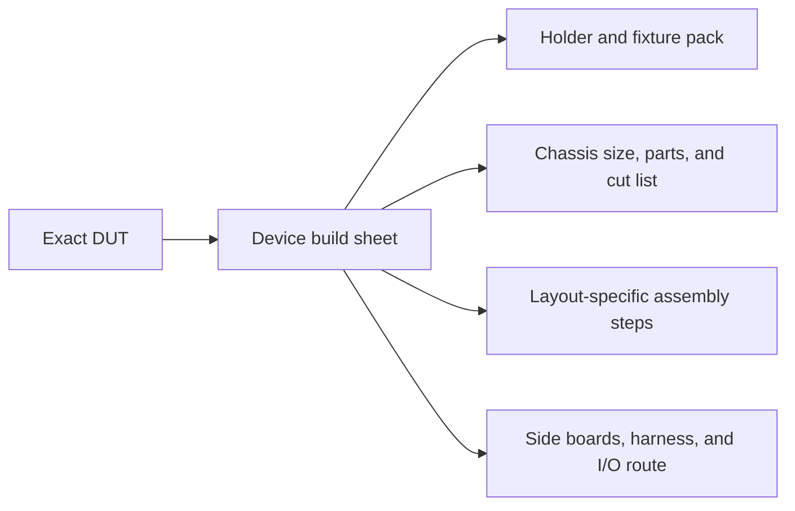

# Choose the device for this test node

Choose the exact handheld **before** collecting parts, generating prints, or
cutting aluminum. The choice resolves a complete build sheet: holder family,
integration route, chassis layout and size, printed pack, cut list, assembly
chapter, and verification gate.

!!! danger "One device choice for the whole build"
    Do not switch the device in the print generator and then continue with a
    different chassis chapter. Return here and start from the matching build
    sheet whenever the DUT changes.

## Generate the instructions for your DUT

<section
  class="pf-guide-selector"
  data-test-node-guide-selector=""
  data-profiles-url="../../assets/test-node-guide-profiles.json">
  

    <label for="pf-guide-device">Choose the handheld you are building around</label>
    <select
      id="pf-guide-device"
      data-guide-device-select=""
      aria-describedby="pf-guide-status"
      disabled>
      <option value="">Choose a DUT…</option>
    </select>
    

      Loading the registered devices…
    

  

  

</section>

<noscript>
  

    
Device build sheets

    
The dropdown needs JavaScript. Continue directly with the
    <a href="devices/powkiddy-x55/">Powkiddy X55 prototype build sheet</a>,
    <a href="devices/trimui-brick/">TrimUI Brick prototype build sheet</a>,
    <a href="devices/trimui-smart-pro/">TrimUI Smart Pro build sheet</a>, or
    <a href="devices/trimui-smart-pro-s/">TrimUI Smart Pro S build sheet</a>;
    each sheet links its complete instruction sequence and qualification gate.

  

</noscript>

All four registered devices now use the successful Pro S continuous-bar
topology: one unspliced 306 mm lower fixture bar and one unspliced 306 mm upper
fixture bar. Their full packs contain no long gantry splice bars, splice
collars, or movable gantry mounts. The Smart Pro family shares its holder and
integration route; its exact device slug still selects the correct carrier,
nameplate, and qualification record. The former qualified gantry layouts stay
frozen as build history rather than being rewritten.

The **TrimUI Brick / TG3040** selects `chassis-dualbar-brick-v2`, which applies
the same side-clear plate revision to its deliberately unqualified prototype
pack. It uses a smaller 180 × 205 mm carrier, a five-part stepped-shell
retention set, and Brick-specific carrier links. Its holder gates remain open
under `tsp-bcx.21.23`, and its side-clear installed gate remains open under
`tsp-bcx.21.38`. Generating its files does not make it production-qualified.

The **Powkiddy X55** selects `chassis-dualbar-powkiddy-x55-v1`. It combines the
continuous-bar topology with a 247 × 175 mm carrier, six edge-specific
contacts, and the same side-clear plate revision. Its bottom, top, and side
shell depths remain provisional under `tsp-bcx.21.28`; print the coupon first and keep the pack a
candidate under `tsp-bcx.21.40` until physical acceptance is recorded.

Holder family, integration profile, and chassis layout are independent
selections in the registry. A future DUT can reuse the same holder or frame
while selecting a different side-board/harness route; a physically larger DUT
can select a new chassis layout without duplicating its electrical profile.

## What the choice controls

| Build module | Smart Pro family today | What a future device may change |
| --- | --- | --- |
| DUT holder | Qualified Smart Pro family, Brick prototype, or X55 prototype | Contact geometry, keep-outs, links, or retention mechanism |
| Chassis | 346 × 358 × approximately 368 mm outside | Width, depth, height, rail inventory, fixture suspension, or stacking details |
| Printed pack | Selected by exact device slug and registered layout | Chassis beds, holder, placard, cable anchors, and device-specific fixtures |
| Integration route | Shared family routing ID | Side boards, power/USB/serial/FEL topology, cables, and service access |
| Assembly | Shared 17-step continuous-bar route | Different step count, order, images, and verification gates |

## Source of truth

The published routing contract is
[`test-node-guide-profiles.json`](../../assets/test-node-guide-profiles.json).
The site build cross-checks every device and layout in that file against the
pinned source-owned device-pack catalog. A missing device page, mismatched
layout, stale qualification state, or absent assembly route fails publication.

Adding a future DUT means adding a registered device build sheet. A genuinely
larger chassis gets a new layout namespace and its own parts, cut, assembly,
and verification pages; it does not alter existing qualified build histories.
