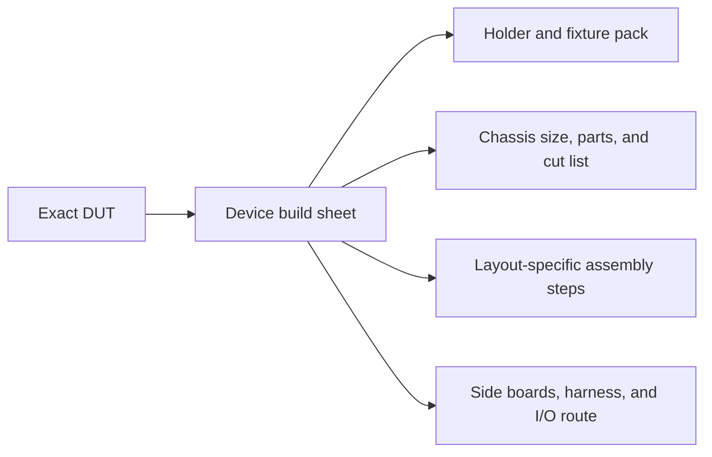

# Choose the device for this test node

Choose the exact handheld **before** collecting parts, generating prints, or
cutting aluminum. The choice resolves a complete build sheet: holder family,
integration route, chassis layout and size, printed pack, cut list, assembly
chapter, and verification gate.

!!! danger "One device choice for the whole build"
    Do not switch the device in the print generator and then continue with a
    different chassis chapter. Return here and start from the matching build
    sheet whenever the DUT changes.

## Generate the instructions for your DUT

<section
  class="pf-guide-selector"
  data-test-node-guide-selector=""
  data-profiles-url="../../assets/test-node-guide-profiles.json">
  

    <label for="pf-guide-device">Choose the handheld you are building around</label>
    <select
      id="pf-guide-device"
      data-guide-device-select=""
      aria-describedby="pf-guide-status"
      disabled>
      <option value="">Choose a DUT…</option>
    </select>
    

      Loading the registered devices…
    

  

  

</section>

<noscript>
  

    
Device build sheets

    
The dropdown needs JavaScript. Continue directly with the
    <a href="devices/trimui-smart-pro/">TrimUI Smart Pro build sheet</a> or the
    <a href="devices/trimui-smart-pro-s/">TrimUI Smart Pro S build sheet</a>;
    each sheet links its complete instruction sequence.

  

</noscript>

The two current devices are close relatives and share the
`trimui-smart-pro-family` holder mechanism and
`trimui-smart-pro-family-v1` integration route. Their registered chassis
layouts still differ today: the original Smart Pro pack remains frozen at its
qualified v1 gantry geometry for reproducibility, while current Smart Pro
builds select the stack-clear `chassis-core-v2` gantry candidate and Smart Pro
S builds select the dual-bar candidate with four printed crossbar-joint
plates. Both current packs use 91.5 mm upper and 108.5 mm lower carrier links
that end 1 mm inside the chassis stack planes. Physical acceptance remains
tracked in `tsp-px73.23`.

Holder family, integration profile, and chassis layout are independent
selections in the registry. A future DUT can reuse the same holder or frame
while selecting a different side-board/harness route; a physically larger DUT
can select a new chassis layout without duplicating its electrical profile.

## What the choice controls

| Build module | Smart Pro family today | What a future device may change |
| --- | --- | --- |
| DUT holder | Shared family carrier and hooks | Contact geometry, keep-outs, links, or retention mechanism |
| Chassis | 346 × 358 × approximately 368 mm outside | Width, depth, height, rail inventory, fixture suspension, or stacking details |
| Printed pack | Selected by exact device slug and registered layout | Chassis beds, holder, placard, cable anchors, and device-specific fixtures |
| Integration route | Shared family routing ID | Side boards, power/USB/serial/FEL topology, cables, and service access |
| Assembly | One route per registered layout | Different step count, order, images, and verification gates |

## Source of truth

The published routing contract is
[`test-node-guide-profiles.json`](../../assets/test-node-guide-profiles.json).
The site build cross-checks every device and layout in that file against the
pinned source-owned device-pack catalog. A missing device page, mismatched
layout, stale qualification state, or absent assembly route fails publication.

Adding a future DUT means adding a registered device build sheet. A genuinely
larger chassis gets a new layout namespace and its own parts, cut, assembly,
and verification pages; it does not alter these two build histories.
