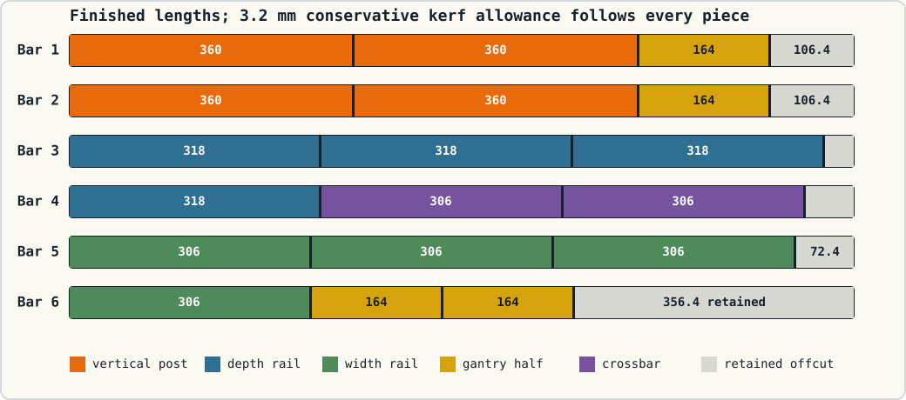

# Cut the aluminum rails

<strong>Compatible DUT:</strong> TrimUI Smart Pro · <code>chassis-core-v1</code>

One chassis fits in six nominal 1 m sticks. Finished dimensions are measured
aluminum lengths—connector caps are not included in the cut length.

## Finished-piece inventory

| Label family | Quantity | Finished length | Use |
| --- | ---: | ---: | --- |
| `POST-*` | 4 | 360 mm | Outer vertical posts |
| `DEPTH-*` | 4 | 318 mm | Operator-to-device outer rails |
| `WIDTH-*` | 4 | 306 mm | Left-to-right outer rails |
| `GANTRY-*-HALF-*` | 4 | 164 mm | Two spliced fixture uprights |
| `GANTRY-CROSS-*` | 2 | 306 mm | Movable fixture crossbars |

!!! note "The 360 mm cuts are posts"
    All four **360 mm** pieces stand vertically. The **356.4 mm** value at the
    end of stock bar 6 is retained offcut, not a chassis rail or post.

Total finished aluminum rail is 5,204 mm. The plan reserves 3.2 mm after every
finished piece for kerf and retains 738.4 mm of combined offcut.

## What “kerf” means here

Kerf is the material removed by the blade. The lab's 0.094 inch blade removes
about 2.39 mm, while this stock plan conservatively reserves 3.2 mm per
finished piece.

Do not add kerf to the requested finished dimension. Mark a 360 mm post, place
the blade on the waste side of that line, cut, then verify the finished post is
360 mm. Measure each next piece from its new clean end. The extra allowance
protects the stock plan from blade width and cleanup cuts.

## Mark before cutting

Use removable tape or a fine marker. The labels below make the preload
instructions unambiguous:

| Finished part | Label |
| --- | --- |
| Operator lower width rail | `WIDTH-O-L` |
| Operator upper width rail | `WIDTH-O-U` |
| Device lower width rail | `WIDTH-D-L` |
| Device upper width rail | `WIDTH-D-U` |
| Left lower / left upper depth rails | `DEPTH-L-L`, `DEPTH-L-U` |
| Right lower / right upper depth rails | `DEPTH-R-L`, `DEPTH-R-U` |
| Operator-left / operator-right / device-left / device-right posts | `POST-OL`, `POST-OR`, `POST-DL`, `POST-DR` |
| Left upright halves | `GANTRY-L-H1`, `GANTRY-L-H2` |
| Right upright halves | `GANTRY-R-H1`, `GANTRY-R-H2` |
| Lower / upper crossbars | `GANTRY-CROSS-L`, `GANTRY-CROSS-U` |

## Six-stick cutting order

| Stock bar | Cuts, in order | Conservative remainder |
| ---: | --- | ---: |
| 1 | 360, 360, 164 mm | 106.4 mm |
| 2 | 360, 360, 164 mm | 106.4 mm |
| 3 | 318, 318, 318 mm | 36.4 mm |
| 4 | 318, 306, 306 mm | 60.4 mm |
| 5 | 306, 306, 306 mm | 72.4 mm |
| 6 | 306, 164, 164 mm | 356.4 mm |

Retain the 356.4 mm offcut. It is long enough to be useful for future
non-structural tooling.

## Cut procedure

1. Measure the actual stock length and choose one square factory end as the
   first datum.
2. Mark every planned finished piece and its identity on the stock before
   starting the saw.
3. Clamp the aluminum rail.
4. Align the blade on the waste side of the mark.
5. Make one witnessed cut and measure the result before batch cutting.
6. Continue by measuring the next finished piece from the new clean end.
7. Deburr the cut and slot openings immediately.
8. Verify and label the piece before placing it in the finished pile.

!!! warning "Do not hide an inaccurate cut in assembly"
    The printed camera-frame collars join two 164 mm halves; they do not
    correct a short outer-frame rail. Recut an out-of-tolerance structural
    piece rather than forcing a connector or squaring the frame against it.

## Cut gate

- [ ] 4 × 360 mm posts.
- [ ] 4 × 318 mm depth rails.
- [ ] 4 × 306 mm width rails.
- [ ] 4 × 164 mm camera-frame upright halves.
- [ ] 2 × 306 mm camera-frame crossbars.
- [ ] Every cut is square, deburred, measured, and labeled.
- [ ] The useful 356.4 mm offcut is retained.

Next: [assemble the chassis in 19 bench steps](assemble/index.md).
