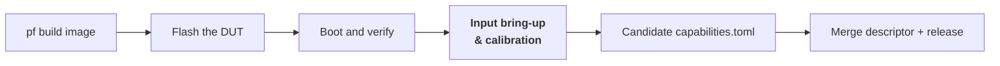

# Input bring-up & calibration

Bring-up doesn't end when Linux boots. A new handheld's controls — face
buttons, D-pad, sticks, triggers, shoulder buttons — reach the kernel as raw
events from evdev, a UART microcontroller, LRADC, or GPIO, and PocketForge
still has to learn which physical control produces which event before any app
sees a coherent gamepad. That learning is what the **on-device input bring-up
and calibration app** does.

Run it **after Linux boots and the device's input decoder is present**, not as
a first step. It renders the device's own body on its own screen, walks you
through pressing each control in turn, and writes a candidate
[`capabilities.toml`](../reference/glossary.md) for the new device from what it
actually observed. The same tool re-runs later to verify buttons still work and
stick ranges haven't drifted.

!!! note "Where this fits in the bring-up flow"
    This is a **mid-stream** step in the
    [⭐ bring-up checklist](../bring-up-checklist.md), positioned after
    [flashing the image](../build-flash/flashing-ladder.md) and confirming the
    device boots to a shell. It replaces the older CLI-dumper flow (running
    `evdev-probe.py` over SSH) with an on-panel guided wizard.

## When to run it

Run the app once, on a freshly-bootstrapped unit, as soon as **all** of these
are true:

- [ ] The device boots to userspace on the flashed image (the boot-and-verify
      step of the [flashing ladder](../build-flash/flashing-ladder.md) passed).
- [ ] The device's input decoder is in place — for evdev-native handhelds this
      is automatic; for a handheld whose pad is a UART microcontroller (the
      A133 base unit is one) the decoder daemon must already be running and
      exposing an `/dev/input/eventN` node for the pad.
- [ ] You have physical access to the device's screen and controls, or
      remote-desktop equivalent — the wizard prompts on-panel and expects the
      user to press each control in turn.

Re-run it later at any time to verify controls after a hardware repair, to
re-calibrate drifted sticks, or to confirm nothing has regressed after a
kernel/firmware bump.

## What the app does

The app is a small statically-linked Rust binary that renders directly to
`/dev/fb0`. It does three jobs; this page focuses on the first (initial
bring-up). The other two are covered by re-runs of the same tool.

1. **Standardization shim.** Interpret each handheld's raw input — evdev, UART
    MCU frames, LRADC, or GPIO — as one canonical gamepad model, honouring
    quirks. The most common quirk on our A133 handhelds is a trigger reported
    over an analog range (e.g. `EV_ABS`/`ABS_Z`, 0–128) that is *physically*
    binary; the shim re-emits it as a button.
2. **Guided ground-truth collection.** Render the device's own body on its
    screen — the same 3D model that generates the pf-hwprobe skin assets,
    drift-gated in the platform repo — highlight the control the wizard wants
    pressed, prompt the user, and record the raw event(s) produced by that
    press. Because the face is the real device rendered from its model, the
    wizard can highlight controls on surfaces a flat 2D sketch can't reach —
    a top-edge trigger, a back-of-shell paddle, a bottom-edge button — even
    though the A133 base unit itself has none on those surfaces. When every
    prompt has been answered, emit a candidate `capabilities.toml` describing
    the new device.
3. **Verify / calibration re-run.** Re-drive the same prompt sequence against
    an existing descriptor and flag any control that doesn't respond, any
    stick range that has drifted outside its calibrated deadzone, or any
    button that has stopped registering.

## Prerequisites

You'll drive the deploy from the laptop; the app runs on the DUT.

- A booted device on the network (base A133: `tsp-base-dut.lan`) with SSH
  reachable — see [SSH etiquette](../reference/troubleshooting.md) if the
  first connect fails.
- A brokered [labgrid place](../lab/labgrid.md) hold on the DUT for the
  duration of the session. On the bench base A133 the place is held
  continuously by the bench session; request a window from its coordinator
  before deploying.
- The `pf-app-deploy` script from
  [`pocketforge-automation`](https://github.com/pocketforge-os/pocketforge-automation),
  which pushes a static aarch64 binary to `/opt/pocketforge/bin/` and
  optionally installs a systemd unit.

!!! tip "The deployed binary is ephemeral"
    `pf-app-deploy` writes into a tmpfs-adjacent path on the running rootfs
    that a full reflash wipes. Re-deploy the app after any full-image flash;
    once the flow is settled the app is baked into the image and this step
    goes away.

## Deploy and launch

Deploy the app to the live DUT with `pf-app-deploy.sh` from the laptop, then
start it on-device. The face the wizard renders is the real device's 3D model
consumed at runtime, so the deploy stages **two** things next to each other:
the static aarch64-musl binary, and the current platform skin (the device
`capabilities.toml` + its `.scad`→skin PNGs). Ship the current skin — not a
stale copy — so a `.scad` geometry fix propagates on the next deploy.

=== "Base (A133)"

    ```bash
    # From the laptop, holding the tsp-base place (brokered — see above).
    # 1. Deploy the binary and install the systemd unit.
    pf-app-deploy.sh \
      target/aarch64-unknown-linux-musl/release/pf-collect-ui \
      --name pf-collect-ui \
      --unit crates/pf-collect-ui/deploy/pf-collect-ui.service \
      --restart

    # 2. Stage the CURRENT platform skin at /opt/pocketforge/skin, mirroring
    #    the platform layout the unit's --descriptor / --skin-root expect:
    #      /opt/pocketforge/skin/devices/a133/capabilities.toml
    #      /opt/pocketforge/skin/skins/a133/*.png
    ```

    The installed unit runs demo mode by default — `pf-collect-ui --mode demo
    --fb /dev/fb0 --descriptor /opt/pocketforge/skin/devices/a133/capabilities.toml
    --skin-root /opt/pocketforge/skin` — which synthesizes one press per
    control so the full render + prompt sequence exercises the panel with no
    live pad decoder required. To record against the real pad instead, run
    `pf-collect-ui --mode live --source /dev/input/eventN --out
    /tmp/candidate.toml` ad-hoc (or drop in a systemd unit override with the
    live args), keeping the same `--descriptor` / `--skin-root` / `--fb`.

    The unit sets `Conflicts=pocketforge-menu.service`, so starting it stops
    the menu and takes `/dev/fb0` over cleanly; stopping the unit hands the
    panel back.

=== "Pro S (A523)"

    !!! warning "🚧 Not yet supported"
        The A133 base unit is the first target. Bring-up support for other
        handhelds (A523 Pro S included) follows once the A133 flow is proven
        end-to-end. This page will grow a Pro S tab when that work lands.

Confirm the panel shows the device rendering and the wizard prompt.
[Check the screen](../reference/troubleshooting.md) if it doesn't.

## Walk the guided prompts

On the panel you'll see the device's own body rendered from its 3D model,
with one control highlighted in yellow and a prompt naming the control
("Press A", "Push LEFT stick fully right", …). Controls on the device's top
or back surfaces (triggers, shoulder buttons, paddles) are shown from the
matching top or back camera angle, so a control the front face can't see is
still visible. For each prompt:

- [ ] Read which control is highlighted and named.
- [ ] Press or move that control on the physical device.
- [ ] Confirm the prompt advances — the highlight moves to the next control.
- [ ] For a stick, sweep it fully in the direction named; the wizard needs to
      observe the endpoints to record the analog range.

The wizard walks the full canonical control list (face buttons, D-pad, both
sticks, both triggers, shoulder buttons, start/select/menu). A control the
device physically lacks (e.g. the base A133 has no L3/R3 or Home) is skipped
via the wizard's "not present" affordance so the emitted descriptor doesn't
falsely claim it.

If you press the wrong control by mistake, back up one prompt and press
again — the wizard commits a recording only when the current prompt advances.

## What you get out of it

When the wizard reaches the end it emits a **candidate `capabilities.toml`**
describing the new device: the identity block, one `[[inputs]]` row per
recorded control (with `ev_type`/`code`/`range` filled in from what it saw),
and — critically — the `semantics="binary"` / `semantics="analog"` flag on
each trigger, derived from whether that trigger reported only endpoint values
during the sweep or intermediate travel.

The candidate file is the starting point for the device's real descriptor
under `platform/devices/<board>/capabilities.toml`. It typically needs a
human pass to fill in the `skin_part` fields (which visual on the device skin
each input maps to) and to review the sensor/actuator sections, but the input
table it produces from observation is the load-bearing part and the most
tedious to author by hand.

!!! example "Validation gate"
    On the base A133 the app-collected map is cross-checked against the
    manually-captured ground truth from `tsp-ozbp.2` before the descriptor is
    accepted — every mismatch is investigated and explained, so a wrong
    reading (from the app, from the manual capture, or from a decoder bug)
    can't silently ship. This gate is the epic's proof that the app itself is
    correct.

## Verify and re-calibrate later

The same tool re-runs against an existing descriptor to verify a device still
matches its recorded map — the "job #3" mode above.

Run it after:

- A hardware repair (a button replacement, a stick swap) — to confirm the new
  part maps to the expected event codes.
- A user report of a stuck or dead button.
- A kernel or firmware bump that could have moved input event codes.

The verify pass drives the same prompt sequence but compares each observed
event to the descriptor rather than authoring one, and flags any control that
doesn't respond or any stick whose range has drifted outside its calibrated
deadzone.

## Where this fits in the whole flow



Building the image ([pf build](../build-flash/pf-build.md)) and getting it
onto the DUT (the [flashing ladder](../build-flash/flashing-ladder.md)) come
first; this section replaces the historical "log in over SSH and dump events
by hand" gap between *boots to a shell* and *has a descriptor* with a
guided on-panel run.
